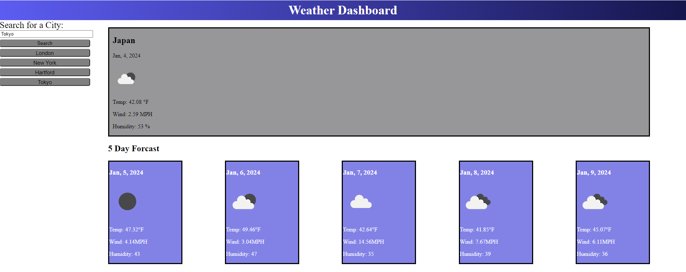

# <Weather-Dashboard>

## Description
    - A client requested a website that could be used to check the current weather and 5 day forcast of a city that is entered into a search bar. Furthermore, it needed to include the creation of buttons that represent each city that was serached for, and upon clicking them, the represented cities data re appears
    - This project was built to allow users to quickly see the current weather, and 5 day forcasts of citys around the world using API calls to gather that data and populate the requested information on this web page.
    - This project was able to solve how to search for a city using an API call, to retireve that cities lattitude and longitude coordinates. Then using those coordinates, prompt another API call to retrieve the weather data of the corresponding city to be displayed in a current weather box, and then also a 5 day forcast box. 
    - This project allowed me to learn how to read an api's documentation to retrieve the necessary data from the returned information, and then using the building blocks from the previous weeks classes, was able to populate the required data on the webpage. 
    

## Installation
    Web Page is in the link below
[Code Quiz](https://neglon.github.io/coding-quiz/)

## Usage
    Upon Vising the page, you are presented with a search bar in the top left corner of the screen, showing a place holder city of San Diego in it. To the right is an already formed box, waiting for data from a search to populate the current Weather. After entering a search, the current weather box and 5, 5 fay forcast boxes populate showing, the date, current temp, a symbol for the current weather, wind speed, and humidity. With every city that you search for, a corresponding button is created below the search bar, these buttons can be clicked to bring back up the weather data for the city that is labeled on the button. Refreshing the page clears these buttons.
   

   
  

## Credits
    N/A

## Liscence
    N/A

## Code Source
    Code fully written by Thomas Neylon, references were made to previous classwork, and stack overflow.

    
[Stack Overflow Event listner for items populated well after page load](https://stackoverflow.com/questions/34896106/attach-event-to-dynamic-elements-in-javascript)

